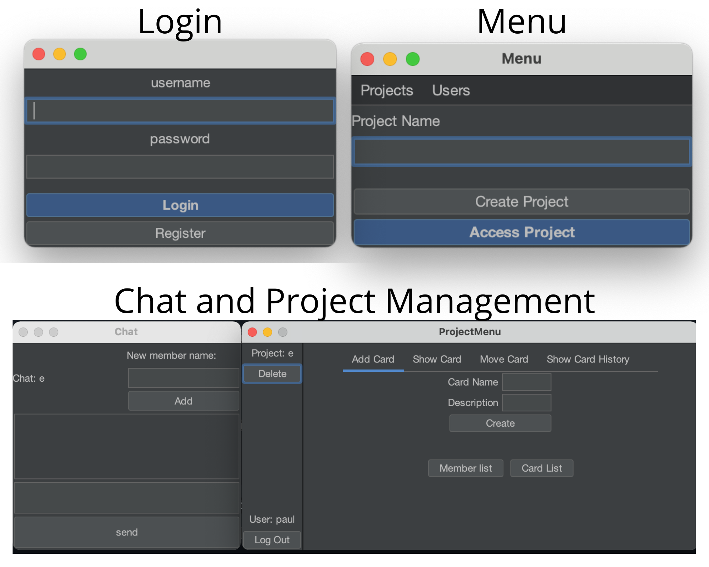

<!-- TABLE OF CONTENTS -->
<details open="open">
  <ol>
    <li><a href="#about-the-project">About The Project</a></li>
    <li><a href="#built-with">Built With</a></li>
    <li><a href="#prerequisites">Prerequisites</a></li>
    <li><a href="#installation">Installation</a></li>
    <li><a href="#usage">Usage</a></li>
    <li><a href="#contact">Contact</a></li>
  </ol>
</details>


<!-- ABOUT THE PROJECT -->
## About The Project
<p align="center">

</p>

This project has educational purpose only. It's made for the Computer Networks Laboratory course ad University of Pisa, by me Paul Magos.

Description:
* It is a project management software, made with in mind the high increase in internet communication needs of 2020
* Takes inspiration from projects such as trello, teams and asanas
* It uses the "Kanban" agile method for organizing projects

* A more detailed description of how this "tool" works, in ITALIAN : [Doc](Doc.pdf)

### Built With

* [Java](https://www.java.com/)
* [JDK8](https://www.oracle.com/it/java/technologies/javase/javase-jdk8-downloads.html) OR [Amazon Corretto 8](https://docs.aws.amazon.com/corretto/latest/corretto-8-ug/downloads-list.html)
* [Jackson](https://github.com/FasterXML/jackson)
* [FlatLaf](https://www.formdev.com/flatlaf/)

<!-- GETTING STARTED -->
## Getting Started
### Prerequisites

* You will need Java jdk 8 to compile 
  1. Windows 
     1. Use this [guide](https://docs.aws.amazon.com/corretto/latest/corretto-8-ug/windows-7-install.html) by Amazon
  2. Linux 
     1. Use this [guide](https://docs.aws.amazon.com/corretto/latest/corretto-8-ug/generic-linux-install.html) by Amazon
  3. MacOS
     1. Use this [guide](https://docs.aws.amazon.com/corretto/latest/corretto-8-ug/macos-install.html) by Amazon
  * You can use the Oracle version as well if you have an account.

### Installation

1. Clone the repo
   ```sh
   git clone https://github.com/PaulMagos/WORTH.git
   ```
2. Open directory
   ```sh
   cd WORTH/src/
   ```
3. Compile
   1. UNIX
     ```sh
     javac -cp MyLib/\* *.java MyExceptions/*.java Client/*.java WorthServer/*.java Client/Frames/*.java WorthServer/Project/*.java WorthServer/User/*.java
     ```
   2. Windows
     ```sh
     javac -cp .;MyLib/jackson-core-2.12.1.jar;MyLib/jackson-databind-2.12.1.jar;MyLib/jackson-annotations-2.12.1.jar;MyLib/flatlaf-0.46.jar *.java MyExceptions/*.java Client/*.java WorthServer/*.java Client/Frames/*.java WorthServer/Project/*.java WorthServer/User/*.java
     ``` 
4. Run Server
   1. UNIX
     ```sh
     java -cp .:MyLib/jackson-core-2.12.1.jar:MyLib/jackson-databind-2.12.1.jar:MyLib/jackson-annotations-2.12.1.jar:MyLib/flatlaf-0.46.jar MainServer [File's Path (default is ../Server/)]
     ```
   2. Windows
     ```sh
     java -cp .;MyLib/jackson-core-2.12.1.jar;MyLib/jackson-databind-2.12.1.jar;MyLib/jackson-annotations-2.12.1.jar;MyLib/flatlaf-0.46.jar MainServer [File's Path (default is ../Server/)]
     ```
5. Run Client
   1. UNIX 
     ```sh
     java -cp .:MyLib/jackson-core-2.12.1.jar:MyLib/jackson-databind-2.12.1.jar:MyLib/jackson-annotations-2.12.1.jar:MyLib/flatlaf-0.46.jar MainClient [Server IP(default is localhost)] [interface type {terminal , gui}]
     ```
   2. Windows 
     ```sh
     java -cp .;MyLib/jackson-core-2.12.1.jar;MyLib/jackson-databind-2.12.1.jar;MyLib/jackson-annotations-2.12.1.jar;MyLib/flatlaf-0.46.jar MainClient [Server IP(default is localhost)] [interface type {terminal , gui}]
     ```

<!-- CONTACT -->
## Contact
[![LinkedIn][linkedin-shield]](https://www.linkedin.com/in/paulmathos/)

<!-- ACKNOWLEDGEMENTS -->
## Acknowledgements
* [JetBrains](https://www.jetbrains.com/)
* [Jackson](https://github.com/FasterXML/jackson)
* [FlatLaf](https://www.formdev.com/flatlaf/)


## A HUGE THANKS TO [othneildrew](https://github.com/othneildrew) FOR THIS [README TEAMPLATE](https://github.com/othneildrew/Best-README-Template)


[linkedin-shield]: https://img.shields.io/badge/-LinkedIn-black.svg?style=for-the-badge&logo=linkedin&colorB=555
